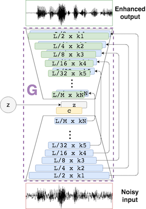
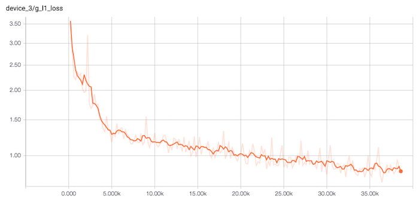
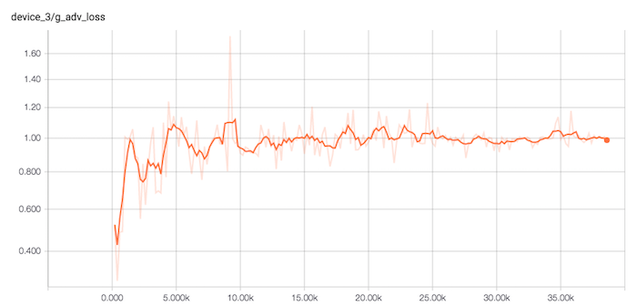

## SEGAN: Speech Enhancement Generative Adversarial Network

### Introduction

This is the repository of the SEGAN project. Our original paper can be found [here](https://arxiv.org/abs/1703.09452), and test samples are available [here](http://veu.talp.cat/segan/).

In this work a Generative Adversarial approach has been taken to do speech enhancement (i.e. removing noise from corrupted speech signals) with a fully convolutional architecture schematized as follows:



This model deals with raw speech waveforms on many noise conditions at different SNRs (40 at training time and 20 during test). It also models the speech characteristics from many speakers mixed within the same structure (without any supervision of identities), which makes the generative structure generalizable in the noise and speaker dimensions.

**All the project is developed with TensorFlow**. There are two repositories that were good references on how GANs are defined and deployed:

* [improved-gan](https://github.com/openai/improved-gan): implementing improvements to train GANs in a more stable way
*  [DCGAN-tensorflow](https://github.com/carpedm20/DCGAN-tensorflow): implementation of the DCGAN in tensorflow

### Dependencies

* Python 2.7
* TensorFlow 0.12

You can install the requirements either to your virtualenv or the system via pip with:

```
pip install -r requirements.txt
```

### Data

The speech enhancement dataset used in this work [(Valentini et al. 2016)](http://ssw9.net/papers/ssw9_PS2-4_Valentini-Botinhao.pdf) can be found in [Edinburgh DataShare](http://datashare.is.ed.ac.uk/handle/10283/1942). However, **the following script downloads and prepares the data for TensorFlow format**:

```
./prepare_data.sh
```

Or alternatively download the dataset, convert the wav files to 16kHz sampling and set the `noisy` and `clean` training files paths in the config file `e2e_maker.cfg` in `cfg/`. Then run the script:

```
python make_tfrecords.py --force-gen --cfg cfg/e2e_maker.cfg
```

### Training

Once you have the TFRecords file created in `data/segan.tfrecords` you can simply run the training process with:

```
./train_segan.sh
```

By default this will take all the available GPUs in your system, if any. Otherwise it will just take the CPU.

**NOTE:** If you want to specify a subset of GPUs to work on, you can do so with the `CUDA_VISIBLE_DEVICES="0, 1, <etc>"` flag in the python execution within the training script. In the case of having two GPUs they'll be identified as 0 and 1, so we could just take the first GPU with: `CUDA_VISIBLE_DEVICES="0"`.

A sample of G losses is interesting to see as stated in the paper, where L1 follows a minimization with a `100` factor and the adversarial loss gets to be equilibrated with low variance:

**L1 loss (smoothing 0.5)**



**Adversarial loss (smoothing 0.5)**



### Loading model and prediction

First, the trained weights will have to be downloaded from [here](https://drive.google.com/open?id=0B6xY-R8JAa8rcGRld1dreGl1RlE).

Then the `main.py` script has the option to process a wav file through the G network (inference mode), where the user MUST specify the trained weights file and the configuration of the trained network. In the case of the v1 SEGAN presented in the paper, the options would be:

```
CUDA_VISIBLE_DEVICES="" python main.py --init_noise_std 0. --save_path segan_v1 \
                                       --batch_size 100 --g_nl prelu --weights SEGAN_full \
                                       --test_wav <wav_filename> --clean_save_path <clean_save_dirpath>
```

To make things easy, there is a bash script called `clean_wav.sh` that accepts as input argument the test filename and
the save path.

### Current line of work

We have worked on improvements that will be available soon, improving the quality of the enhanced speech.

### Authors

* **Santiago Pascual** (TALP-UPC, BarcelonaTech)
* **Antonio Bonafonte** (TALP-UPC, BarcelonaTech)
* **Joan Serrà** (Telefónica Research, Barcelona)

### Contact

e-mail: santi.pascual@upc.edu
